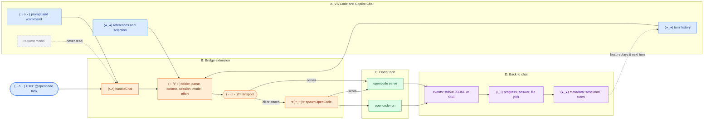

# (・∀・) 1. Big picture

[← index](README.md) · next: [One chat turn →](02-chat-turn.md)

## (´-ω-) Five facts the picture hides

1. **No tool bridge.** Copilot tools are not sent to OpenCode, and OpenCode
   tools are not exposed to Copilot.
2. **The model comes from `model:` or settings**, not from Copilot's picker;
   so does the reasoning effort (`effort:` or the `effort` setting).
3. **History is not forwarded as messages.** It only recovers the OpenCode
   `sessionId`; OpenCode keeps the real conversation.
4. **Attachments become a text preamble.** Files are not uploaded; OpenCode
   reads them from `cwd`.
5. **Every OpenCode process goes through `spawnOpenCode()`** (`proc.ts`),
   including `serve`.
