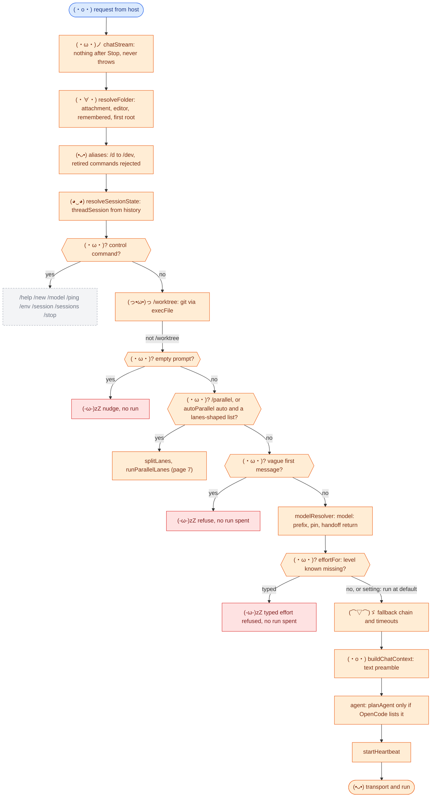
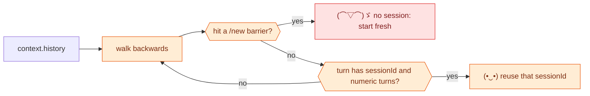

# (•ᴗ•) 2. One chat turn

[← big picture](01-big-picture.md) · [index](README.md) · next: [Transport →](03-transport.md)

Everything here happens in `handleChat` (`src/chat.ts`) **before** OpenCode runs; the run itself, its recovery and the answer are `runTurn` (`src/chat-turn.ts`), and `/parallel` is `runParallelTurn` (`src/chat-parallel.ts`).

## The vague-prompt gate, exactly

It refuses only when **all** hold: setting `clarifyVaguePrompts` is on, it is
the **first** message of the thread (no session yet), there are **no**
references, selection or inline origin, the text is judged vague, and the user
has not insisted. The reply points to `/ping` and gives example tasks; a
"Run it" chip is the way through.

## (◕‿◕) Thread to session binding

Anything that re-binds a chat (`/sessions` Continue, Fork) must return that
metadata, because metadata is the only binding.

## What the host gives that is dropped

| Dropped | Why |
| --- | --- |
| `request.model` | Never read; the model is OpenCode's |
| Copilot tools | No `languageModelTools` contribution |
| History as messages | Only used to find the sessionId |
| Attachment bytes | Folded into text; OpenCode reads from `cwd` |
