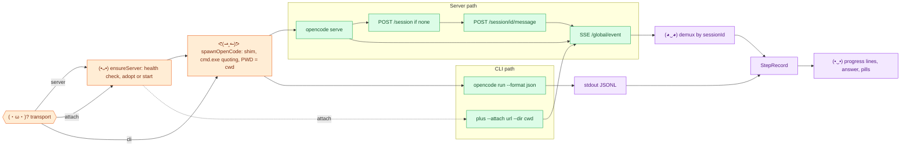
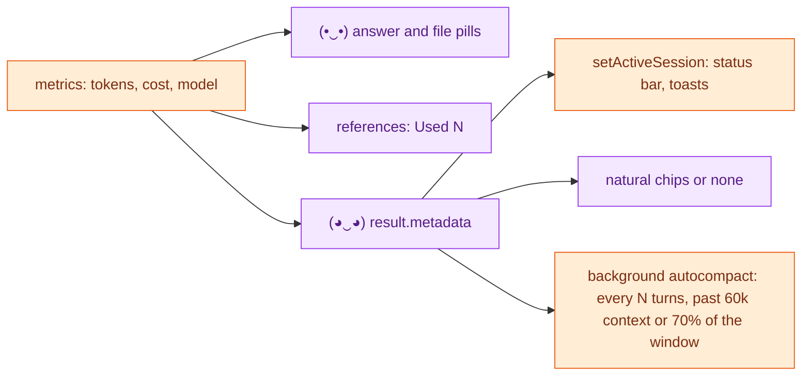

# ᕙ(⇀‸↼)ᕗ 3. Transport: how the request leaves and the answer returns

[← one chat turn](02-chat-turn.md) · [index](README.md) · next: [Recovery →](04-recovery.md)

## Choosing a transport

```
useServer = transport == "server" || (transport == "auto" && !isBuild)
attachDev = transport == "auto" && setting attachDevToServer (default true)
```

| Turn | Transport | Why |
| --- | --- | --- |
| Read-only (plan, look) with `auto` | server | Warm server avoids 48 to 69 s cold boots |
| `/dev` (build) with `auto` | CLI attached to the warm server | `--auto` exists only on the CLI |
| `transport: cli` | cold CLI | Explicit |
| `transport: server` | server | Explicit |



## Effort on the wire

| Path | How the variant goes |
| --- | --- |
| CLI and attached CLI | `opencode run --variant <level>` |
| Server | `"variant": "<level>"` in the `POST /session/:id/message` body |

Sent every turn when set; never sent when empty. See page 7.

## SSE rules that matter

- **One shared stream, demuxed by session id.** `message.updated` carries a
  message id, not a session id; `server.heartbeat` carries none. Only a run's
  own events prove it alive.
- **Every call carries `?directory=<cwd>`.** Without it the server uses its
  own cwd, which may be another window's checkout.
- **Killing an attach client does not stop the run**, and a prompt to a busy
  session queues silently. So every stop aborts on the server, and every send
  checks busy first.

## Headless sessions

Sessions the bridge creates deny `question`, `plan_enter` and `plan_exit`
(`HEADLESS_PERMISSION`), and the bridge answers every permission or question ask
of the session and its subagents itself, keyed by `readOnly`. Nobody can answer
OpenCode's prompts from a chat turn.

## (•‿•) Post-run


