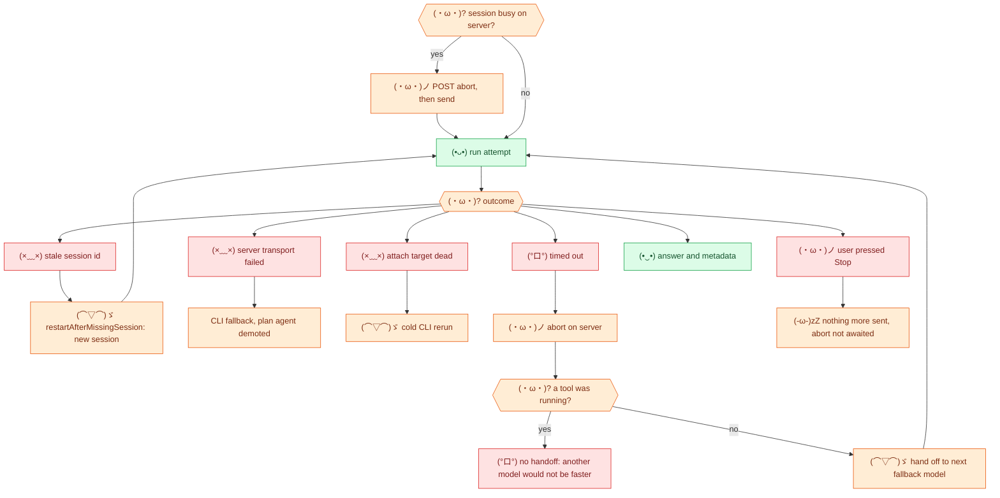

# (⌒▽⌒)ゞ 4. Recovery and Stop

[← transport](03-transport.md) · [index](README.md) · next: [APIs →](05-apis.md)

## The recovery ladder

| Step | Trigger | Result |
| --- | --- | --- |
| Stale session | `isMissingSessionError` (server) or `isMissingSessionRun` (CLI exit) | New session, answer reset |
| Server failed | Thrown error on server transport | CLI takes this and later attempts. If the agent was confirmed by the server only, it runs as the built-in `plan`, with a visible warning |
| Attach dead | `isAttachFailure` | Same attempt rerun cold |
| Timeout | `timeoutMs` elapsed | Server abort awaited, then maybe handoff |
| Handoff | Model stall only | Next model in the chain; after an unpinned handoff the next turn sends the earlier model once |
| Stop | Cancellation token | Server abort **not** awaited |

## (・ω・)ノ Stop, precisely

- After Stop **nothing** arrives in the stream.
- About **1 s later the host stream throws**, so a turn must return within
  that second. This is why server aborts are fire-and-forget after Stop.
- Plain progress lines fade; task lines stay; a task open at Stop spins for
  good. So accordions are sent finished, and `stop()` waits `SETTLE_MS` after
  the last one.

## Test anchors (suite groups cited in AGENTS.md)

`HQ` headless asks · `LT4` `LT5` abort and busy checks · `LT7` liveness ·
`SP` stop · `PA` plan agent · `DM` handoff model · `GP` accordions.
