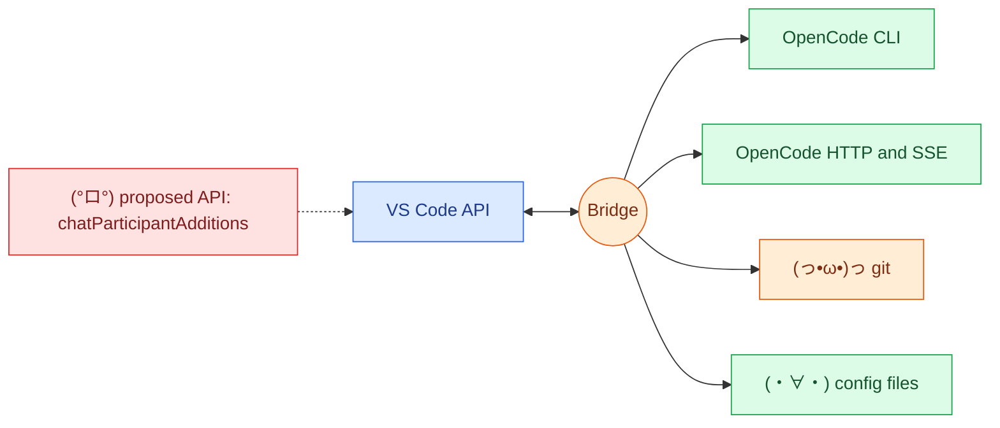

# ᕙ(⇀‸↼)ᕗ 5. APIs touched

[← recovery](04-recovery.md) · [index](README.md) · next: [Trust and trade-offs →](06-trust-and-tradeoffs.md)

## VS Code

| Area | APIs |
| --- | --- |
| Chat | `chat.createChatParticipant` (panel and inline), `followupProvider` |
| Response stream | `markdown`, `progress`, `anchor`, `reference`, `button`, `filetree`; task-progress overload feature-detected |
| Commands | `registerCommand`, `executeCommand("workbench.action.chat.open")` with `isPartialQuery: true` |
| Window | output channel, status bar, `showQuickPick`, `createQuickPick`, messages, `withProgress`, `showTextDocument` |
| Workspace | `getConfiguration`, folders, trust, `onDidChangeConfiguration`, `openTextDocument` |
| Env | `appName`, `remoteName`, `uiKind`, `clipboard` |
| Proposed | `chatParticipantAdditions` (needs `--enable-proposed-api` or Insiders) |
| Activation | `onChatParticipant:*` only; `deactivate()` kills the managed server |

## OpenCode CLI (always via `spawnOpenCode`)

| Command | Used for |
| --- | --- |
| `run [--attach url --dir cwd] [--agent] [--model] [--session] [--pure] [--auto] [--format json] [--thinking]` | A turn |
| `serve --port --hostname` | Managed server |
| `agent list` | Which agents exist (`planAgent` is sent only once listed) |
| `models [--verbose]` | Catalog fallback |
| `--version` | `/ping` |

(°ロ°) `opencode run --agent <unknown>` silently runs `build` (exit 0). Always pass `--agent`.

## OpenCode HTTP (every call has `?directory=`)

| Method and path | Used for |
| --- | --- |
| `GET /global/health` | Is a server there, and is it OpenCode (`version`) |
| `GET /global/event` | Shared SSE stream |
| `POST /session` | Create, with headless permissions |
| `GET /session?roots=true&limit=50` | `/sessions` picker |
| `POST /session/:id/message` | Send a turn |
| `GET /session/:id/message?limit=` | Last messages |
| `GET /session/status` | Busy check |
| `POST /session/:id/abort` | Stop, timeout, busy |
| `POST /session/:id/summarize` | Autocompact |
| `POST /session/:id/fork`, `PATCH` and `DELETE /session/:id` | Fork, archive, delete, permission re-PATCH |
| `GET /agent`, `GET /config/providers` | Agents, model catalog |
| `POST /permission/:id/reply`, `POST /question/:id/reply` | Headless answers |
| `POST /session/:id/permissions/:permissionID` | The same answer for a pre-1.1 server (docs, not measured) |

SSE events consumed: `message.part.updated`, `message.updated`,
`session.error`, `session.created`, `permission.asked`, `question.asked`;
`permission.updated` (pre-1.1) is answered like `permission.asked`, and
`permission.replied` confirms a reply (a 200 alone proves nothing, #15386).
`server.heartbeat` is ignored for liveness.

> Checked in source (`net.ts`, `sessions.ts`, `run-server.ts`, `server-session.ts`, `asks.ts`, `models.ts`):
> `/global/health`, `/global/event`, `/session/status`, `/agent`,
> `/config/providers`, `roots=true`, and `message`, `abort`, `fork`,
> `summarize` via `sessionPath(id, "...")`. Only matched by name, not read
> call by call: `/permission`, `/question`, `PATCH`, `DELETE`, and the
> `limit=50` value.

## (っ•ω•)っ git (only `src/worktree.ts`)

`execFile("git", argsArray)`: worktree add, list, remove, branch, diff. Never
through the `cmd.exe` path. The one thing written outside OpenCode:
`<repo>.worktrees/<slug>`, on command.

## (・∀・) Files read (read-only)

`opencode.json(c)`, global config, instruction files such as `AGENTS.md`, and
agent, plugin, MCP, command and skill listings, for `/env` and `/ping`.
Nothing is injected.
