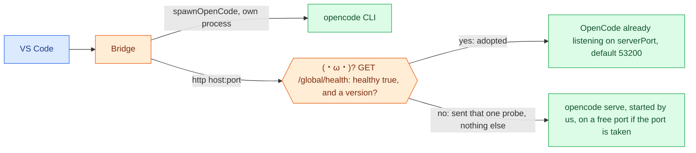

# (°ロ°) 6. Trust, pros and cons, next steps

[← APIs](05-apis.md) · [index](README.md)

## Trust boundaries

- (•‿•) **Adoption needs an identity (0.0.205).** `ensureServer` adopts a
  listener on the configured port only if `GET /global/health` answers
  `healthy: true` and names a `version`, as the real server does (the OpenCode
  docs list it). Anything else on that port is sent that one probe; this window
  starts its own server on a free port. A server this window started needs no
  version. Before the check, `scripts/probe-server-adoption.js` measured a fake
  listener receiving `POST /session` and `POST /session/<id>/message` with the
  prompt text in the body, and the workspace path in every `?directory=`.
  Since 0.0.201 the default port is `53200`, off OpenCode's common `4096`; `0`
  starts a private server on a free port and adopts nothing. Not measured:
  whether 1.18.27 to 1.18.33 send `version`.
- (•‿•) **Mitigation in place.** Untrusted workspaces cannot set `executable`,
  `serverHostname` or `serverPort`; the default host is `127.0.0.1`.
- **Session ids are untrusted:** URLs via `sessionPath`, argv via `safeSessionId`.

## (•‿•) Pros

| Strength | Evidence |
| --- | --- |
| Layered recovery | Stale session, server to CLI, attach to cold, busy abort, model handoff |
| One spawn point | `spawnOpenCode`; a suite tripwire counts `spawn(` sites |
| Strong gate | `npm run ship`, 4 fail-fast checks; fake OpenCode binaries; `hostStream()` models the real host |
| Isolation | One session per chat, `?directory=` on every call, headless sessions, nothing written to the workspace except `/worktree` |
| No runtime deps | Plain `tsc`, no bundler |
| Measured facts | `REFS.md` records what each OpenCode quirk cost |

## (×﹏×) Cons and risks

| Risk | Why it matters |
| --- | --- |
| Undocumented OpenCode behaviour | Pinned to versions 1.18.27 to 1.18.34: `?directory=` semantics, message-vs-session ids, fork dropping permission rules, attach kill not stopping the run. A server outside that range earns one line saying so (0.0.204); nothing negotiates, so an update can still break it |
| Proposed API | `chatParticipantAdditions` blocks Marketplace publishing and needs cast hacks that rot as the API stabilises |
| Windows weight | `proc.ts` is dominated by `cmd.exe` workarounds; other platforms are less exercised |
| Big modules | `runs.ts` (0.0.203), `chat-boot.ts` (0.0.204) and `handleChat` (0.0.205: `chat.ts` about 310 lines, `chat-turn.ts` 560, `chat-parallel.ts` 170) were split; the largest module is now `net.ts` (about 670); 33 modules are reachable from `chat.js` (a require walk over `out/`) |
| Heuristic streaming | `emitKeyedDelta` guesses ids when parts lack them; duplicate or lost text is possible |
| Metadata is the only binding | A lost blob silently starts a new session |
| Chat UI limits | No Thinking part or tool rows (proposed), no in-place progress, badges are inline-code pills |
| Bespoke tests | Not the VS Code test runner, no coverage metric, aborts on the first exception |

## (´-ω-) Suggestions, in order

1. **Probe the adoption risk.** Done: `scripts/probe-server-adoption.js`.
2. **Identity check before adoption.** Done (0.0.205): a version is required
   (suite `ID`).
3. **Version guard.** Done (0.0.204): a health `version` outside the tested
   range gets one line per window and version.
4. **Split `handleChat`.** Done (0.0.205): `chat.ts` routes and gates,
   `chat-turn.ts` opens, prepares, runs the recovery ladder and posts,
   `chat-parallel.ts` runs `/parallel`. (`runs.ts` was split in 0.0.203.)
5. **Decide the proposed-API stance:** sideloaded VSIX only, or wait.
6. **Keep these docs honest:** a suite check that fails if a function named in
   `docs/flow` disappears (needs a version bump and the next free check code).

(°ロ°) Items 1 to 4 change code or the suite, so each needs a version bump and
a green `npm run ship`.
