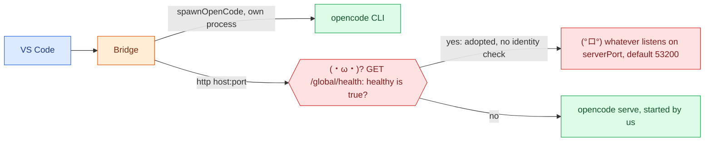

# (°ロ°) 6. Trust, pros and cons, next steps

[← APIs](05-apis.md) · [index](README.md)

## Trust boundaries

- (°ロ°) **Adoption without identity.** `ensureServer` adopts any listener
  answering `{ "healthy": true }` on the configured port. Since 0.0.201 the
  default is `53200`, off OpenCode's common `4096`; `0` starts a private server
  on a free port and adopts nothing.
  Measured by `scripts/probe-server-adoption.js`: a fake listener received
  `POST /session` and `POST /session/<id>/message` with the prompt text in the
  body, and the workspace path in every `?directory=`. The real server's health
  answer carries a `version` field (1.18.34) that the bridge ignores.
- (•‿•) **Mitigation in place.** Untrusted workspaces cannot set `executable`,
  `serverHostname` or `serverPort`; the default host is `127.0.0.1`.
- **Session ids are untrusted:** URLs via `sessionPath`, argv via `safeSessionId`.

## (•‿•) Pros

| Strength | Evidence |
| --- | --- |
| Layered recovery | Stale session, server to CLI, attach to cold, busy abort, model handoff |
| One spawn point | `spawnOpenCode`; a suite tripwire counts `spawn(` sites |
| Strong gate | `npm run ship`, 4 fail-fast checks; fake OpenCode binaries; `hostStream()` models the real host |
| Isolation | One session per chat, `?directory=` on every call, headless sessions, nothing written to the workspace except `/worktree` |
| No runtime deps | Plain `tsc`, no bundler |
| Measured facts | `REFS.md` records what each OpenCode quirk cost |

## (×﹏×) Cons and risks

| Risk | Why it matters |
| --- | --- |
| Undocumented OpenCode behaviour | Pinned to versions 1.18.27 to 1.18.33: `?directory=` semantics, message-vs-session ids, fork dropping permission rules, attach kill not stopping the run. No version negotiation, so an update can break it silently |
| Proposed API | `chatParticipantAdditions` blocks Marketplace publishing and needs cast hacks that rot as the API stabilises |
| Windows weight | `proc.ts` is dominated by `cmd.exe` workarounds; other platforms are less exercised |
| Big modules | `chat.ts` about 900 lines; `runs.ts` (0.0.203) and `chat-boot.ts` (0.0.204) were split, the largest parts now about 440 (`run-cli.ts`) and 400 (`heartbeat.ts`); one turn touches about 28 modules |
| Heuristic streaming | `emitKeyedDelta` guesses ids when parts lack them; duplicate or lost text is possible |
| Metadata is the only binding | A lost blob silently starts a new session |
| Chat UI limits | No Thinking part or tool rows (proposed), no in-place progress, badges are inline-code pills |
| Bespoke tests | Not the VS Code test runner, no coverage metric, aborts on the first exception |

## (´-ω-) Suggestions, in order

1. **Probe the adoption risk.** Done: `scripts/probe-server-adoption.js`.
2. **Identity check before adoption.** Half done: the default port moved off
   `4096` (0.0.201). Left: compare a version or nonce before adopting.
3. **Version guard.** Read `opencode --version` at startup and warn outside the
   tested range.
4. **Split `handleChat`** into route, gates, run, recover, post. (`runs.ts`
   was split in 0.0.203: `run-cli`, `run-server`, `run-steps`, `asks`,
   `server-session`.)
5. **Decide the proposed-API stance:** sideloaded VSIX only, or wait.
6. **Keep these docs honest:** a suite check that fails if a function named in
   `docs/flow` disappears (needs a version bump and the next free check code).

(°ロ°) Items 1 to 4 change code or the suite, so each needs a version bump and
a green `npm run ship`.
