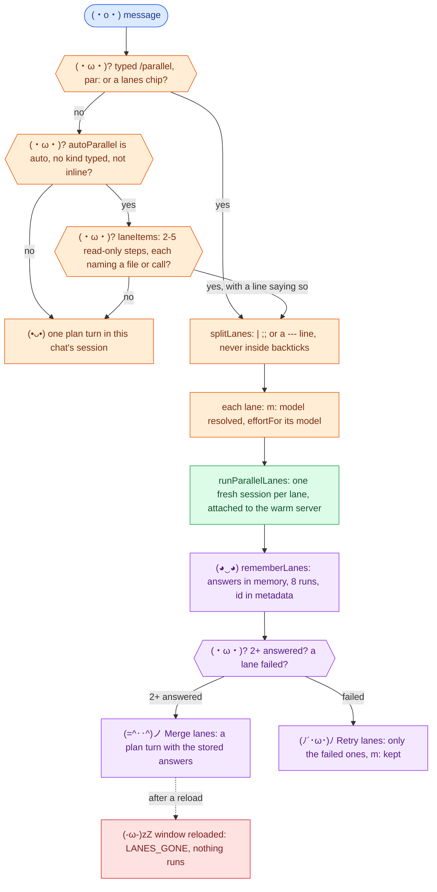
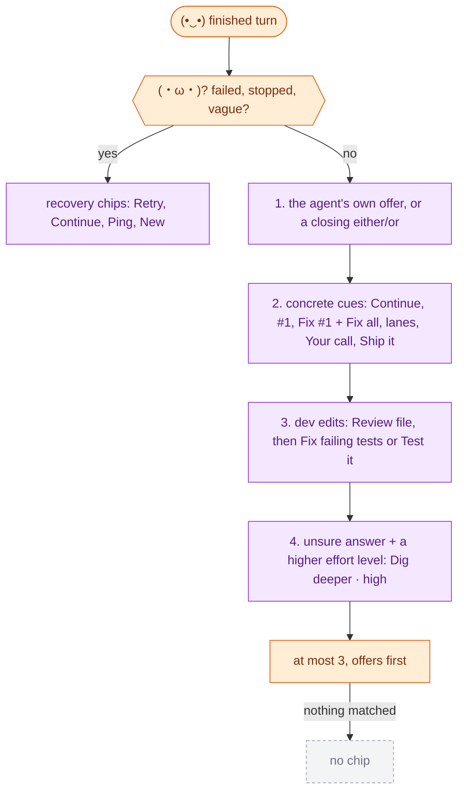
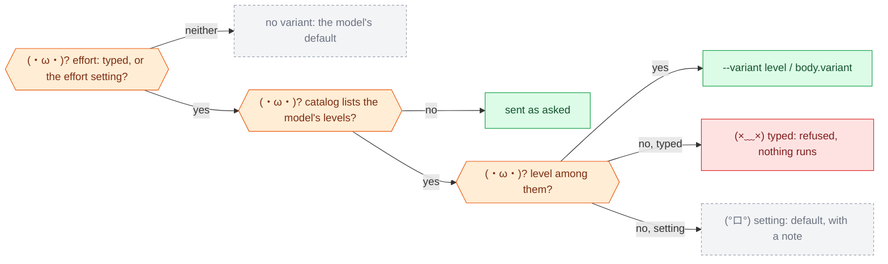
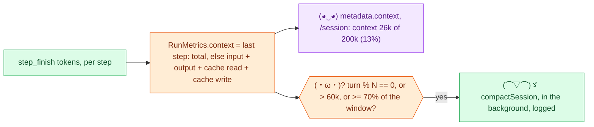

# (•ᴗ•) 7. Lanes, chips, effort and context

[← trust](06-trust-and-tradeoffs.md) · [index](README.md)

Four things that decide **what the next turn costs**: whether a message fans
out into lanes, which chips a finished turn offers, how hard the model thinks,
and when the session is compacted. Anchors are function names.

## Lanes: from a message to merged answers

| `autoParallel` | Plan answer shaped like lanes | Message shaped like lanes |
| --- | --- | --- |
| `offer` (default) | **Run N as lanes** chip | one turn |
| `auto` | chip | runs as lanes; `plan:` keeps one turn |
| `off` | nothing | one turn |

Why not always automatic: every lane is a paid run, and lane answers reach the
chat's session only through **Merge lanes**.

## Chips: natural or none

Every word a chip shows or sends is in `src/followups.json`; check `NF` holds
the answers that must get **no** chip.

## Effort: which variant is sent

- Sent **every turn**: a prompt without one resets the session to `default`.
- Fallback models and each lane are checked against **their own** model.
- The model picker shows each model's levels; **Dig deeper** asks for the next
  one up (`higherEffort`).

## Context: when the session is compacted

Before 0.0.202 the trigger summed `input` over the turn's steps: a 3-step turn
with a 25k context read as 75k, and a cached 70k context (input 100) read as 100.

## (•‿•) Evidence

| Claim | Where |
| --- | --- |
| OpenCode ignores an unknown variant | `session/llm/request.ts` (1.18.34): `model.variants[name]`, no error |
| A prompt without a variant resets the session to default | `session/prompt.ts` (1.18.34), `setAgentModel(... variant ?? "default")` |
| OpenCode sizes context by the last step, cache in | `session/overflow.ts` `isOverflow` (1.18.34) |
| `opencode run --agent <subagent>` falls back to the default agent | `cli/cmd/run.ts` (1.18.34) warns and falls back |
| Each rule above has suite checks | groups `EF` `CX` `AP` `FT` `SG` |
